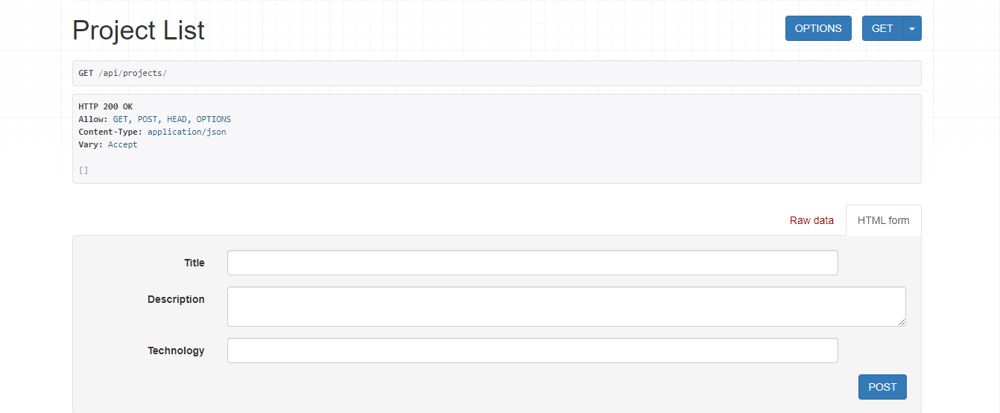

# ApiResDjango

## Resumen de un Proyecto Django con Django REST Framework (DRF) para una API REST

1. **Configuración del Proyecto:**
   - Inicia un proyecto Django con `django-admin startproject nombre_proyecto`.
   - Configura el archivo `settings.py` para ajustes del proyecto.

2. **Creación de una Aplicación:**
   - Crea una aplicación con `python manage.py startapp nombre_app`.
   - Define modelos de datos en el archivo `models.py`.

3. **Serializers:**
   
   - Utiliza serializers de DRF en `serializers.py` para convertir modelos a JSON.

5. **Vistas:**
   - Define vistas en `views.py`, incluyendo vistas basadas en funciones o clases.
   - Configura operaciones CRUD con métodos como `list`, `create`, `retrieve`, `update`, `destroy`.

6. **Rutas URL:**
   - Configura rutas URL en `urls.py` para las vistas de la API.
   - Usa el enrutador de DRF para gestionar las rutas URL de vistas basadas en clases.

7. **Configuración de Serializers y Vistas:**
   - Define cómo se serializan y deserializan datos en `views.py`.

8. **Pruebas:**
   - Escribe pruebas unitarias e integración para validar el funcionamiento de la API.

9. **Autenticación y Autorización:**
   - Implementa autenticación y autorización según necesidades.
   - Utiliza métodos de autenticación y autorización integrados en DRF.

10. **Documentación:**
   - Genera documentación con herramientas como DRF's browsable API o Swagger.

11. **Despliegue:**
    - Despliega el proyecto Django y la API REST en un servidor adecuado.

Este resumen proporciona una visión general de cómo se estructura un proyecto Django con DRF para una API REST.

